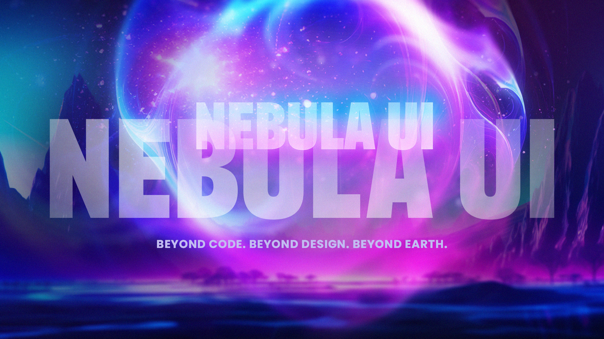

<div align="center">
  
</div>

<div align="center">
  
</div>

<div align="center">

# Nebula UI

A modern, intuitive, and customizable UI framework designed for seamless integration and exceptional user experiences.

[](https://github.com/cturk/nebula-ui/blob/main/LICENSE)
[](https://github.com/cturk/nebula-ui/blob/main/CONTRIBUTING.md)
[](https://github.com/cturk/nebula-ui/issues)

</div>

## Status

🚧 **Project Status: Early Development** 🚧

Nebula UI is currently in early development. We're actively working on core components and establishing the foundation for a robust UI framework. While not yet ready for production use, we welcome developers to explore, provide feedback, and contribute to shaping its future.

## Features

- 🎨 Modern Design System
- 🔧 Highly Customizable Components
- 📱 Responsive by Default
- ⚡ Optimized Performance
- 🌐 Cross-Browser Compatible

## Getting Started

### Installation

```bash
npm install nebula-ui
```

### Basic Usage

```javascript
import { Button, Card } from 'nebula-ui';

function App() {
  return (
    <div>
      <Button variant="primary">Click Me</Button>
      <Card>
        <h2>Welcome to Nebula UI</h2>
        <p>Start building beautiful interfaces today!</p>
      </Card>
    </div>
  );
}
```

## Documentation

For comprehensive documentation, visit our [GitHub Wiki](https://github.com/cturk/nebula-ui/wiki). Here you'll find:
- Component API Reference
- Theming Guide
- Customization Options
- Best Practices
- Examples and Tutorials

## Contributing

We welcome contributions! Please see our [Contributing Guide](https://github.com/cturk/nebula-ui/blob/main/CONTRIBUTING.md) for details on:
- Code of Conduct
- Development Process
- Pull Request Guidelines
- Development Setup

## License

This project is licensed under the MIT License - see the [LICENSE](https://github.com/cturk/nebula-ui/blob/main/LICENSE) file for details.

---

<div align="center">
  <p>Built with ❤️ by the Nebula UI Team</p>
  <p>
    <a href="https://github.com/cturk/nebula-ui/stargazers">⭐ Star us on GitHub</a> •
    <a href="https://github.com/cturk/nebula-ui/issues">🐛 Report Bug</a> •
    <a href="https://github.com/cturk/nebula-ui/issues">✨ Request Feature</a>
  </p>
</div>